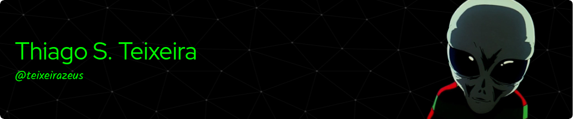

Welcome to my GitHub profile! Here, you'll find a collection of packages that I've developed mainly in Python and Dart/Flutter, as well as a variety of older projects that I've archived for reference.

Currently, my focus is on Internet of Things (IoT) solutions, with particular work on the [nanocortex](https://github.com/teixeirazeus/Nanocortex).